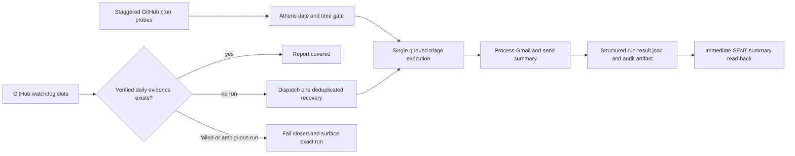

# Daily Gmail Triage reliability architecture

## Goal and boundary

The daily routine stays fully GitHub-hosted. It does not depend on Codex, a
local computer, Cloudflare, or Google Apps Script. GitHub may delay or drop a
scheduled event, so this design reduces that platform risk but cannot eliminate
it without a scheduler outside GitHub.

## Execution flow

## Reliability invariants

1. The `gmail-triage` concurrency group queues pending runs and never cancels a
   pending recovery in favor of a later cron probe.
2. The Athens-aware gate rejects early, stale, and duplicate candidates before
   Gmail mutation begins.
3. Any recorded processing error makes `Run triage` fail, even if the Python
   process reached the end of its loop.
4. A run is not accepted merely because the workflow is green. Required
   evidence is: successful checkout and triage step, `errors=0`,
   `summary_sent=1`, non-empty audit artifact, and exactly one SENT daily summary
   whose referenced emails all contain `Received:` dates.
5. New runs store counters in `audit/run-result.json`. The watchdog reads this
   structured record instead of scraping console logs. Log parsing remains only
   as transition compatibility for older artifacts.
6. Recovery dispatch is preceded by two read-only coverage checks. An ambiguous
   POST is reconciled but never blindly repeated.
7. A run that may have partially changed Gmail is not automatically replayed.
   The watchdog fails closed and identifies the run rather than risking a
   duplicate summary or repeated mutation.

## Residual risk

All automatic triggers still use GitHub Actions scheduling. GitHub documents
that scheduled events can be delayed and, under sufficiently high load, may be
dropped. Staggered probes and three watchdog slots reduce the probability of a
miss but do not create an independent failure domain.

If automatic replay after a partially failed triage is ever required, add an
encrypted daily transaction manifest with explicit `prepared`, `summary_sent`,
and `finalized` stages. That is intentionally separate from schedule recovery:
replaying Gmail mutations without such a manifest would be less safe, not more
reliable.
